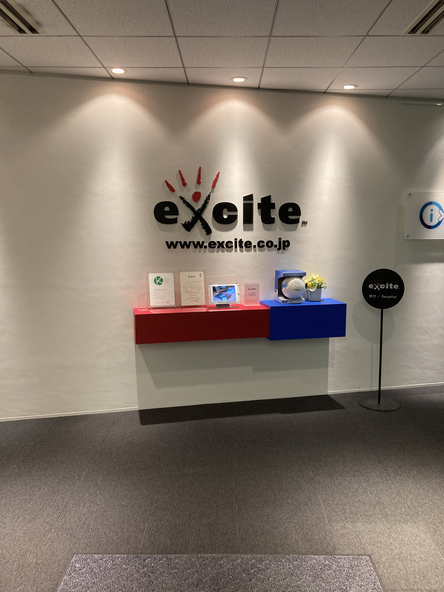
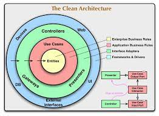
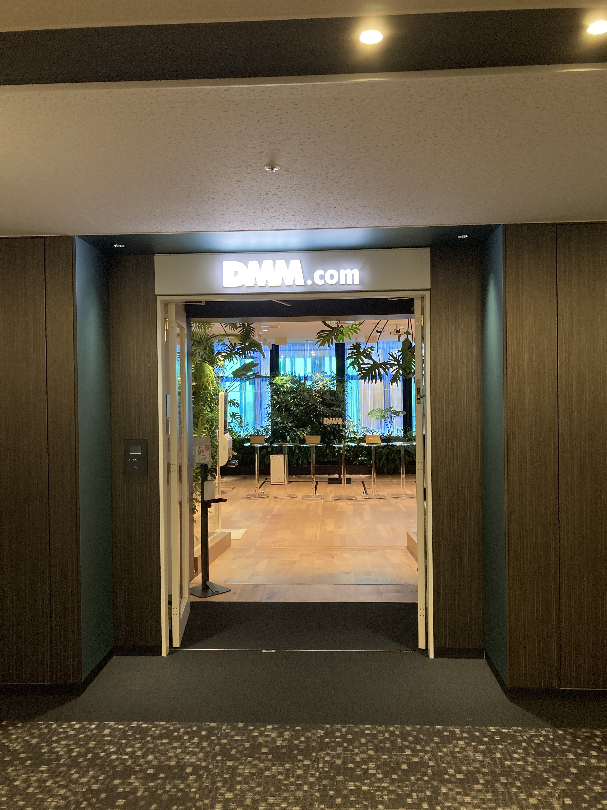

# 2022年振り返り

## はじめに

この記事は[Aizu Advent Calendar 2022](https://adventar.org/calendars/7651)の9日目の記事です。（え？）

2023年にまで持ち越してしまってすいません。ほんとにごめんなさい。

## 本題

謝罪をしたところで本題に移ろうと思います。  
2022年は学部3年として過ごした年であり、自分にとって得られるものが大きかった年だったと感じています。  
ということで、時系列順に振り返るのではなく成長した部分に着目して振り返ってみようと思います。

### 技術的な成長

技術的な成長に関しては、インターンの影響がかなり大きいです。  
夏休みの2ヶ月間、その後に1ヶ月間どちらもバックエンドエンジニアとして就業型インターンに行きました。

これまでにインターンは行ったことがなかったので、自分の技術力が通用するのかという不安が行く前には大きかったです。特に、バックエンドエンジニアとしての経験はかなり少ない状態だったので、右も左もわからない状態のままインターンに突撃してしまって申し訳ない。。。とか内心思ってたりしてたと思います。

#### 1社目のインターン

人生初インターンともなる1社目は、エキサイトホールディングス株式会社さんでした。

インターン先の事業部ではJavaを使っていたのですが、実は僕は大学の授業の「JavaⅡ」の単位を落としてしまっています(1敗)。また、それより重要な「Javaでの開発経験」もほとんど無く、競技プログラミングの文脈で少しかじった程度でした。

実際にインターンに行ってみると、懇切丁寧に知らない単語を教えてくれるメンターさんに出会って、バックエンドエンジニアとしての基礎がある程度固まったと思います。もうほんとになんでも質問したら教えてくれて、介護されていました。ありがたい。。。

インターンでの学びとして、設計周りの知識、実際の職場の雰囲気、求められていそうな技術力あたりを知れたのが大きかったです。技術的な学びと同じくらい大きい精神面的な学びなどについては次の章とかで後述します。

設計周りの知識に関して、インターン前までは名前は知っているけど実際にどんな効能を持っているのかは知らない、という状態でした。特に、クリーンアーキテクチャなんかがまさしくそれで、名前はよく見かけるしよく聞くけど、具体的にどういう考え方なのかは知らなかったです。

よく見かける図↓

(Clean Architecture 達人に学ぶソフトウェアの構造と設計 より)

こういったアーキテクチャに関する部分への意識だったり、イメージだったりが身についたインターンだったと思います。（コードだけでなくDB設計などについても）

設計周りの用語集とかは知っておき得&&知っているだけで考えられる幅が広がると思うので、今後もどんどん吸収していきたいです。

あと、1回出社する機会があったのですが、東京駅で30分〜1時間くらい迷子になりましたw。魔境すぎる。。。道を訪ねたら親切に答えてくれた警備員さんに感謝🙏

#### 2社目のインターン

2社目のインターンは合同会社DMM.comさんでした。  

インターン先の事業部ではバックエンドにGoを使っていました。他の技術スタックも含め、全体を通してモダンな構成だった印象です。

技術的な成長に関しては、やはり設計周りの知識であったり、Goの書き方であったりが主になると思います。

例.

- ドメイン駆動設計
  - 厳密にはドメイン駆動設計の一部分
- Go全般
  - ポインタを返り値とする場合のメリットデメリットとか、現在の流行りの書き方とか

あと、インターン後に[DMM.go #5](https://inside.dmm.com/entry/2022/12/23/dmmgo-5)に登壇させていただきました。当日の発表をあとから見返してみてかなり拙いものになってしまっていたので、公開していただいてるスライドは修正したものとなっています。緊張のしすぎで1スライドでかなり時間をかけた喋り方をしていたり、そもそも主要な部分の説明ができていなかったり。。。色々と思うところはありますが、それでも非常に楽しかったイベントでした。ʕ◔ϖ◔ʔ

実際、このインターンでの技術的な成長はもちろんあるのですが、個人的にはエンジニアとしてのあり方の成長の方が大きかったと感じています。

### エンジニアとしての成長

先程からちょくちょく話に上がっている、エンジニアとしての在り方だったり、精神面的な成長について書いていこうと思います。

#### フルサイクルエンジニアについて

これはDMM.comでのインターン中に知った概念です。  
自分の目指す将来のエンジニアとしての在り方に一番近く、具体的な形だと思っています。

フルサイクルエンジニアとは、2018年にNetflix社のブログ内で提唱された概念です。

- [原典](https://netflixtechblog.com/full-cycle-developers-at-netflix-a08c31f83249)
- [日本語訳バージョン](https://techblog.cartaholdings.co.jp/entry/2019/02/04/171325)

ざっくり説明すると、1つのプロダクトに対する保守運用など全てに対してエンジニアが回していく、みたいな考え方でかなり面白いと思っています。

これは別の話ではありますが、プロダクトにまつわる関係者には「開発者」「顧客」「消費者」の三者がいる中で、そのどれにもなることが出来るのが「開発者」のみ、という話に近いなと思いました。（エンジニアが横断的に仕事を行うという点で）

貪欲に学んでいく意識と、高い開発速度を求められる在り方だなとは思うのですが、プロダクトを主導で動かすという面白さが一番魅力的なんじゃないかと思います。

#### コミュニケーションの大切さ

また、2つのインターンを通して自分の考えを発信していくことや円滑なコミュニケーションを目指そうと努力することはかなり重要なんだと感じました。

おそらく業務を進める上でチームで理想とすべきは「チーム内/間での心理的安全性が高い状態」なんだと思います。

心理的安全性のわかりやすい図↓

[心理的安全性のわかりやすい図](https://twitter.com/ryouen/status/1539437638632890369?s=20&t=5gussCjjIRdtVG4k1_QVZg)

ちょうど後輩に心理的安全性の塊みたいな子がいるので、インターン中ではその子に倣って考えたり行動したりしていました。

#### 論理的思考力の大切さ

エンジニアとして重要なスキルTOP3はなんですか？と聞かれたらこれが1位になりそうなくらい、大事だと思います。というか大事です。

かなり抽象的なので具体例を挙げると、

マニュアル「この関数はマークダウンのファイルからメタデータを消去して本文を返す関数だから`removeMetaData`になっています」

自分「ん？それって、メタデータを消去するというより、「本文を取得する」のが目的なんだから`getBody`とか`extractBody`の方が命名として適切なんじゃない？」

みたいな感じです。(例も割と抽象的だけど)

命名とか設計とか常に至るところで要求されるので、論理的思考力の塊になれればかなり強いと思います。

インターン中コードを読んでいるときに「わっっっっっっかりやっっす！！！天才か？このコード書いた人」とか、「ん？この関数は何がしたいんだ？」みたいに思ったことで、論理的思考力って必要なんだなぁと感じました。

### 成長部分まとめ

2022年は技術面、精神面で成長できた1年となりました。  
インターンの影響がほんとに大きかったように思えます。今回は文量的に書きませんでしたが、インターン以外でも色んな部分で成長できた1年だったかなと思います。

## あとがき

自作ブログの記念すべき1記事目として書きましたが、書式などが崩れていないか心配です。  
もし何かあれば[@matumoto_1234](https://twitter.com/matumoto_1234)(もしくはSlackなど)に連絡して下さい🙇‍♂️

また改めて、2022年のアドベントカレンダーの記事としてはかなり遅れてしまってほんとごめんなさい！年末をだら〜っと過ごしていたらいつのまにか年越してました。

2023年は技術面のさらなる成長と、フルスタックっぽく色んな分野の知識を学んでいけたらと思います！

ここまで見てくださってありがとうございました！
